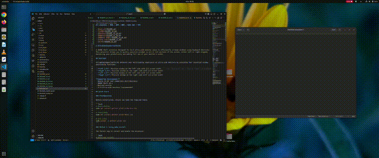

## Languages / 言語 / 语言 / 語言 / Ngôn ngữ / 언어

- [English](README.md)
- [日本語](README_ja.md)
- [简体中文](README_zh_CN.md)
- [繁體中文](README_zh_TW.md)
- [繁體中文（香港）](README_zh_HK.md)
- [Tiếng Việt](README_vi.md)
- [한국어](README_ko.md)

# UltraWideSnapperTwoThirds

A GNOME Shell extension designed for 21:9 ultra-wide monitor users to efficiently arrange windows using keyboard shortcuts. This extension allows you to quickly position windows in 2/3 or 1/3 sections of the screen, either left or right aligned, maximizing your productivity and making full use of your monitor's width.

## Overview

UltraWideSnapperTwoThirds enhances your multitasking experience on ultra-wide monitors by providing four essential window positioning functions:

- **Left 2/3**: Position window on the left side with 2/3 screen width
- **Right 2/3**: Position window on the right side with 2/3 screen width  
- **Left 1/3**: Position window on the left side with 1/3 screen width
- **Right 1/3**: Position window on the right side with 1/3 screen width



**Supported Environment:**
- Ubuntu 22.04 (and compatible distributions)
- GNOME Shell 42.x
- Wayland session
- 21:9 Ultra-wide monitors (recommended)

## Quick Start

### Prerequisites

Before installation, ensure you have the required tools:

```bash
# Ubuntu/Debian
sudo apt install gettext glib2.0-dev-bin zip

# Fedora/RHEL
sudo dnf install gettext glib2-devel zip

# Arch Linux
sudo pacman -S gettext glib2 zip
```

### Method 1: Using make install

The fastest way to install and enable the extension:

```bash
# Build and install
make install

# Restart GNOME Shell (logout and login)
# Then enable the extension
gnome-extensions enable uws2t@muyesh.github.io
```

### Method 2: Manual installation

For more control over the installation process:

```bash
# Build the extension
make build

# Copy to extensions directory
cp -r build/uws2t@muyesh.github.io ~/.local/share/gnome-shell/extensions/

# Restart GNOME Shell (logout and login)
# Then enable the extension
gnome-extensions enable uws2t@muyesh.github.io
```

**Important:** After installation, you must restart GNOME Shell by logging out and logging back in. The extension will not be recognized until GNOME Shell is restarted.

### Verify Installation

Check if the extension is enabled:

```bash
gnome-extensions list --enabled | grep uws2t
```

### Window Positioning Functions

| Function | Default Shortcut | Description |
|----------|------------------|-------------|
| Left 2/3 | `Ctrl+Super+Left` | Position window on left side with 2/3 width |
| Right 2/3 | `Ctrl+Shift+Super+Right` | Position window on right side with 2/3 width |
| Right 1/3 | `Ctrl+Super+Right` | Position window on right side with 1/3 width |
| Left 1/3 | `Ctrl+Shift+Super+Left` | Position window on left side with 1/3 width |

### How It Works

Each positioning function operates in three steps:

1. **Unmaximize**: If the window is maximized, it will be unmaximized first
2. **Calculate Size**: Determine the target width (1/3 or 2/3 of work area)
3. **Position**: Move and resize the window to the calculated position and size

### Customization

You can customize keyboard shortcuts through the extension preferences:

```bash
gnome-extensions prefs uws2t@muyesh.github.io
```


## Installation & Build

### Build System

This extension uses a Makefile-based build system with the following main targets:

| Target | Description |
|--------|-------------|
| `make build` | Compile translations and schemas |
| `make install` | Build and install extension locally |
| `make package` | Create distribution zip package |
| `make clean-all` | Remove all generated files |

### Detailed Build Process

1. **Compile translations** (if you've modified translation files):
   ```bash
   make compile-translations
   ```

2. **Compile GSettings schemas**:
   ```bash
   make compile-schemas
   ```

3. **Full build**:
   ```bash
   make build
   ```

4. **Create distribution package**:
   ```bash
   make package
   ```

### Uninstallation

To remove the extension:

```bash
make uninstall
```

## Project Structure

```
uws2t@muyesh.github.io/
├── extension.js              # Main extension functionality
├── prefs.js                  # Settings/preferences UI
├── metadata.json             # Extension metadata
├── convenience.js            # Utility functions
├── schemas/                  # GSettings schemas
│   ├── org.gnome.shell.extensions.uws2t.gschema.xml
│   └── gschemas.compiled
├── locale/                   # Compiled translations
│   └── */LC_MESSAGES/*.mo
├── po/                       # Translation sources
│   ├── *.po                  # Translation files
│   └── *.pot                 # Translation template
├── build/                    # Build output directory
├── Makefile                  # Build system
├── release.sh               # Release automation script
└── validate.sh              # Package validation script
```

### Key Files

- **extension.js**: Contains the main window positioning logic and keyboard shortcut handlers
- **prefs.js**: Provides the preferences dialog for customizing shortcuts
- **metadata.json**: Defines extension metadata including UUID, version, and supported GNOME Shell versions
- **schemas/**: Contains GSettings schema definitions for storing user preferences

## Development

### Setting Up Development Environment

1. **Clone the repository**:
   ```bash
   git clone https://github.com/muyesh/uws2t.git
   cd uws2t
   ```

2. **Install development dependencies**:
   ```bash
   # Ubuntu/Debian
   sudo apt install gettext glib2.0-dev-bin
   ```

3. **Build and install for testing**:
   ```bash
   make install
   ```

### Adding Translations

1. **Extract translatable strings**:
   ```bash
   make extract-strings
   ```

2. **Update existing translations**:
   ```bash
   make update-po
   ```

3. **Add a new language** (replace `LANG` with language code):
   ```bash
   # Add LANG to LANGUAGES in Makefile
   # Create po/LANG.po file
   make update-po
   ```

4. **Compile translations**:
   ```bash
   make compile-translations
   ```

### Supported Languages

Currently supported languages:
- English (en)
- Japanese (ja)
- Chinese Simplified (zh_CN)
- Chinese Traditional (zh_TW)
- Chinese Hong Kong (zh_HK)
- Vietnamese (vi)
- Korean (ko)

### Development Workflow

1. **Make changes** to source files
2. **Test locally**:
   ```bash
   make install
   # Logout/login to restart GNOME Shell
   gnome-extensions enable uws2t@muyesh.github.io
   ```
3. **Check logs** if needed:
   ```bash
   journalctl -f -o cat /usr/bin/gnome-shell | grep UltraWideSnapperTwoThirds
   ```

## License

MIT License

Copyright (c) 2025 Shizhuo Muye

Permission is hereby granted, free of charge, to any person obtaining a copy
of this software and associated documentation files (the "Software"), to deal
in the Software without restriction, including without limitation the rights
to use, copy, modify, merge, publish, distribute, sublicense, and/or sell
copies of the Software, and to permit persons to whom the Software is
furnished to do so, subject to the following conditions:

The above copyright notice and this permission notice shall be included in all
copies or substantial portions of the Software.

THE SOFTWARE IS PROVIDED "AS IS", WITHOUT WARRANTY OF ANY KIND, EXPRESS OR
IMPLIED, INCLUDING BUT NOT LIMITED TO THE WARRANTIES OF MERCHANTABILITY,
FITNESS FOR A PARTICULAR PURPOSE AND NONINFRINGEMENT. IN NO EVENT SHALL THE
AUTHORS OR COPYRIGHT HOLDERS BE LIABLE FOR ANY CLAIM, DAMAGES OR OTHER
LIABILITY, WHETHER IN AN ACTION OF CONTRACT, TORT OR OTHERWISE, ARISING FROM,
OUT OF OR IN CONNECTION WITH THE SOFTWARE OR THE USE OR OTHER DEALINGS IN THE
SOFTWARE.

**Note:** This extension was developed with the assistance of generative AI technology to enhance development efficiency and code quality.
