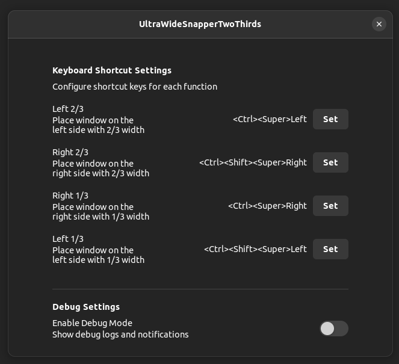

## 语言 / Languages / 言語 / 語言 / Ngôn ngữ / 언어

- [English](README.md)
- [日本語](README_ja.md)
- [简体中文](README_zh_CN.md)
- [繁體中文](README_zh_TW.md)
- [繁體中文（香港）](README_zh_HK.md)
- [Tiếng Việt](README_vi.md)
- [한국어](README_ko.md)

# UltraWideSnapperTwoThirds

专为21:9超宽显示器用户设计的GNOME Shell扩展，通过键盘快捷键高效排列窗口。此扩展允许您快速将窗口定位到屏幕的2/3或1/3区域，左对齐或右对齐，最大化您的生产力并充分利用显示器的宽度。

## 概述

UltraWideSnapperTwoThirds通过提供四个基本的窗口定位功能，增强您在超宽显示器上的多任务体验：

- **左侧 2/3**：将窗口定位在左侧，宽度为屏幕的2/3
- **右侧 2/3**：将窗口定位在右侧，宽度为屏幕的2/3
- **左侧 1/3**：将窗口定位在左侧，宽度为屏幕的1/3
- **右侧 1/3**：将窗口定位在右侧，宽度为屏幕的1/3

**支持环境：**
- Ubuntu 22.04（及兼容发行版）
- GNOME Shell 42.x
- Wayland会话
- 21:9超宽显示器（推荐）

## 快速开始

### 前提条件

安装前，请确保您已安装所需工具：

```bash
# Ubuntu/Debian
sudo apt install gettext glib2.0-dev-bin zip

# Fedora/RHEL
sudo dnf install gettext glib2-devel zip

# Arch Linux
sudo pacman -S gettext glib2 zip
```

### 方法1：使用make install

安装和启用扩展的最快方法：

```bash
# 构建和安装
make install

# 重启GNOME Shell（注销并重新登录）
# 然后启用扩展
gnome-extensions enable uws2t@muyesh.github.io
```

### 方法2：手动安装

如需更好地控制安装过程：

```bash
# 构建扩展
make build

# 复制到扩展目录
cp -r build/uws2t@muyesh.github.io ~/.local/share/gnome-shell/extensions/

# 重启GNOME Shell（注销并重新登录）
# 然后启用扩展
gnome-extensions enable uws2t@muyesh.github.io
```

**重要提示：** 安装后，您必须通过注销并重新登录来重启GNOME Shell。在GNOME Shell重启之前，扩展不会被识别。

### 验证安装

检查扩展是否已启用：

```bash
gnome-extensions list --enabled | grep uws2t
```

## 功能

### 窗口定位功能

| 功能 | 默认快捷键 | 描述 |
|------|-----------|------|
| 左侧 2/3 | `Ctrl+Super+Left` | 将窗口定位在左侧，宽度为2/3 |
| 右侧 2/3 | `Ctrl+Shift+Super+Right` | 将窗口定位在右侧，宽度为2/3 |
| 右侧 1/3 | `Ctrl+Super+Right` | 将窗口定位在右侧，宽度为1/3 |
| 左侧 1/3 | `Ctrl+Shift+Super+Left` | 将窗口定位在左侧，宽度为1/3 |

### 工作原理

每个定位功能分三个步骤操作：

1. **取消最大化**：如果窗口已最大化，将首先取消最大化
2. **计算大小**：确定目标宽度（工作区域的1/3或2/3）
3. **定位**：将窗口移动并调整到计算出的位置和大小

### 自定义

您可以通过扩展首选项自定义键盘快捷键：

```bash
gnome-extensions prefs uws2t@muyesh.github.io
```



## 安装与构建

### 构建系统

此扩展使用基于Makefile的构建系统，具有以下主要目标：

| 目标 | 描述 |
|------|------|
| `make build` | 编译翻译和模式 |
| `make install` | 构建并本地安装扩展 |
| `make package` | 创建分发zip包 |
| `make clean-all` | 删除所有生成的文件 |

### 详细构建过程

1. **编译翻译**（如果您修改了翻译文件）：
   ```bash
   make compile-translations
   ```

2. **编译GSettings模式**：
   ```bash
   make compile-schemas
   ```

3. **完整构建**：
   ```bash
   make build
   ```

4. **创建分发包**：
   ```bash
   make package
   ```

### 卸载

要删除扩展：

```bash
make uninstall
```

## 项目结构

```
uws2t@muyesh.github.io/
├── extension.js              # 主扩展功能
├── prefs.js                  # 设置/首选项UI
├── metadata.json             # 扩展元数据
├── convenience.js            # 实用函数
├── schemas/                  # GSettings模式
│   ├── org.gnome.shell.extensions.uws2t.gschema.xml
│   └── gschemas.compiled
├── locale/                   # 编译的翻译
│   └── */LC_MESSAGES/*.mo
├── po/                       # 翻译源文件
│   ├── *.po                  # 翻译文件
│   └── *.pot                 # 翻译模板
├── build/                    # 构建输出目录
├── Makefile                  # 构建系统
├── release.sh               # 发布自动化脚本
└── validate.sh              # 包验证脚本
```

### 关键文件

- **extension.js**：包含主要的窗口定位逻辑和键盘快捷键处理程序
- **prefs.js**：提供用于自定义快捷键的首选项对话框
- **metadata.json**：定义扩展元数据，包括UUID、版本和支持的GNOME Shell版本
- **schemas/**：包含用于存储用户首选项的GSettings模式定义

## 开发

### 设置开发环境

1. **克隆仓库**：
   ```bash
   git clone https://github.com/muyesh/uws2t.git
   cd uws2t
   ```

2. **安装开发依赖**：
   ```bash
   # Ubuntu/Debian
   sudo apt install gettext glib2.0-dev-bin
   ```

3. **构建并安装以供测试**：
   ```bash
   make install
   ```

### 添加翻译

1. **提取可翻译字符串**：
   ```bash
   make extract-strings
   ```

2. **更新现有翻译**：
   ```bash
   make update-po
   ```

3. **添加新语言**（将`LANG`替换为语言代码）：
   ```bash
   # 在Makefile的LANGUAGES中添加LANG
   # 创建po/LANG.po文件
   make update-po
   ```

4. **编译翻译**：
   ```bash
   make compile-translations
   ```

### 支持的语言

当前支持的语言：
- 英语 (en)
- 日语 (ja)
- 简体中文 (zh_CN)
- 繁体中文 (zh_TW)
- 繁体中文（香港） (zh_HK)
- 越南语 (vi)
- 韩语 (ko)

### 开发工作流程

1. **修改**源文件
2. **本地测试**：
   ```bash
   make install
   # 注销/登录以重启GNOME Shell
   gnome-extensions enable uws2t@muyesh.github.io
   ```
3. **如需要，检查日志**：
   ```bash
   journalctl -f -o cat /usr/bin/gnome-shell | grep UltraWideSnapperTwoThirds
   ```

## 许可证

MIT License

Copyright (c) 2025 Shizhuo Muye

Permission is hereby granted, free of charge, to any person obtaining a copy
of this software and associated documentation files (the "Software"), to deal
in the Software without restriction, including without limitation the rights
to use, copy, modify, merge, publish, distribute, sublicense, and/or sell
copies of the Software, and to permit persons to whom the Software is
furnished to do so, subject to the following conditions:

The above copyright notice and this permission notice shall be included in all
copies or substantial portions of the Software.

THE SOFTWARE IS PROVIDED "AS IS", WITHOUT WARRANTY OF ANY KIND, EXPRESS OR
IMPLIED, INCLUDING BUT NOT LIMITED TO THE WARRANTIES OF MERCHANTABILITY,
FITNESS FOR A PARTICULAR PURPOSE AND NONINFRINGEMENT. IN NO EVENT SHALL THE
AUTHORS OR COPYRIGHT HOLDERS BE LIABLE FOR ANY CLAIM, DAMAGES OR OTHER
LIABILITY, WHETHER IN AN ACTION OF CONTRACT, TORT OR OTHERWISE, ARISING FROM,
OUT OF OR IN CONNECTION WITH THE SOFTWARE OR THE USE OR OTHER DEALINGS IN THE
SOFTWARE.

**注意：** 此扩展是在生成式AI技术的协助下开发的，以提高开发效率和代码质量。
