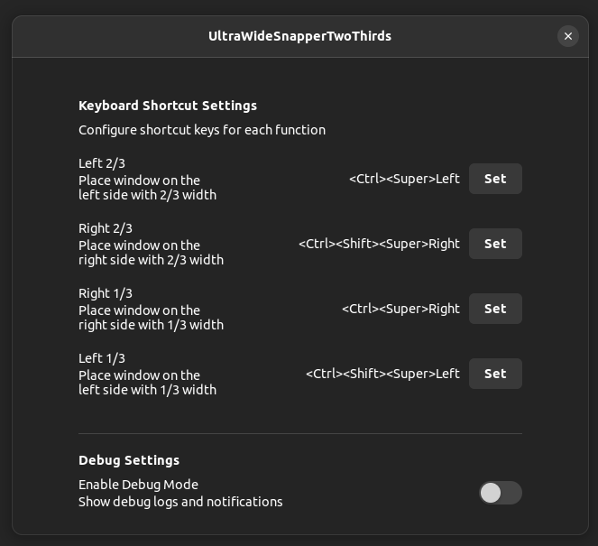

## 語言 / Languages / 言語 / 语言 / Ngôn ngữ / 언어

- [English](README.md)
- [日本語](README_ja.md)
- [简体中文](README_zh_CN.md)
- [繁體中文](README_zh_TW.md)
- [繁體中文（香港）](README_zh_HK.md)
- [Tiếng Việt](README_vi.md)
- [한국어](README_ko.md)

# UltraWideSnapperTwoThirds

專為21:9超寬顯示器用戶設計的GNOME Shell擴展程式，透過鍵盤快捷鍵高效排列視窗。此擴展程式讓您快速將視窗定位到螢幕的2/3或1/3區域，左對齊或右對齊，最大化您的生產力並充分利用顯示器的寬度。

## 概述

UltraWideSnapperTwoThirds透過提供四個基本的視窗定位功能，增強您在超寬顯示器上的多工體驗：

- **左側 2/3**：將視窗定位在左側，寬度為螢幕的2/3
- **右側 2/3**：將視窗定位在右側，寬度為螢幕的2/3
- **左側 1/3**：將視窗定位在左側，寬度為螢幕的1/3
- **右側 1/3**：將視窗定位在右側，寬度為螢幕的1/3

**支援環境：**
- Ubuntu 22.04（及相容發行版）
- GNOME Shell 42.x
- Wayland工作階段
- 21:9超寬顯示器（建議）

## 快速開始

### 前置條件

安裝前，請確保您已安裝所需工具：

```bash
# Ubuntu/Debian
sudo apt install gettext glib2.0-dev-bin zip

# Fedora/RHEL
sudo dnf install gettext glib2-devel zip

# Arch Linux
sudo pacman -S gettext glib2 zip
```

### 方法1：使用make install

安裝和啟用擴展程式的最快方法：

```bash
# 建置和安裝
make install

# 重新啟動GNOME Shell（登出並重新登入）
# 然後啟用擴展程式
gnome-extensions enable uws2t@muyesh.github.io
```

### 方法2：手動安裝

如需更好地控制安裝過程：

```bash
# 建置擴展程式
make build

# 複製到擴展程式目錄
cp -r build/uws2t@muyesh.github.io ~/.local/share/gnome-shell/extensions/

# 重新啟動GNOME Shell（登出並重新登入）
# 然後啟用擴展程式
gnome-extensions enable uws2t@muyesh.github.io
```

**重要提示：** 安裝後，您必須透過登出並重新登入來重新啟動GNOME Shell。在GNOME Shell重新啟動之前，擴展程式不會被識別。

### 驗證安裝

檢查擴展程式是否已啟用：

```bash
gnome-extensions list --enabled | grep uws2t
```

## 功能

### 視窗定位功能

| 功能 | 預設快捷鍵 | 描述 |
|------|-----------|------|
| 左側 2/3 | `Ctrl+Super+Left` | 將視窗定位在左側，寬度為2/3 |
| 右側 2/3 | `Ctrl+Shift+Super+Right` | 將視窗定位在右側，寬度為2/3 |
| 右側 1/3 | `Ctrl+Super+Right` | 將視窗定位在右側，寬度為1/3 |
| 左側 1/3 | `Ctrl+Shift+Super+Left` | 將視窗定位在左側，寬度為1/3 |

### 工作原理

每個定位功能分三個步驟操作：

1. **取消最大化**：如果視窗已最大化，將首先取消最大化
2. **計算大小**：確定目標寬度（工作區域的1/3或2/3）
3. **定位**：將視窗移動並調整到計算出的位置和大小

### 自訂

您可以透過擴展程式偏好設定自訂鍵盤快捷鍵：

```bash
gnome-extensions prefs uws2t@muyesh.github.io
```



## 安裝與建置

### 建置系統

此擴展程式使用基於Makefile的建置系統，具有以下主要目標：

| 目標 | 描述 |
|------|------|
| `make build` | 編譯翻譯和結構描述 |
| `make install` | 建置並本機安裝擴展程式 |
| `make package` | 建立發佈zip套件 |
| `make clean-all` | 刪除所有產生的檔案 |

### 詳細建置過程

1. **編譯翻譯**（如果您修改了翻譯檔案）：
   ```bash
   make compile-translations
   ```

2. **編譯GSettings結構描述**：
   ```bash
   make compile-schemas
   ```

3. **完整建置**：
   ```bash
   make build
   ```

4. **建立發佈套件**：
   ```bash
   make package
   ```

### 解除安裝

要移除擴展程式：

```bash
make uninstall
```

## 專案結構

```
uws2t@muyesh.github.io/
├── extension.js              # 主要擴展程式功能
├── prefs.js                  # 設定/偏好設定UI
├── metadata.json             # 擴展程式中繼資料
├── convenience.js            # 實用函式
├── schemas/                  # GSettings結構描述
│   ├── org.gnome.shell.extensions.uws2t.gschema.xml
│   └── gschemas.compiled
├── locale/                   # 編譯的翻譯
│   └── */LC_MESSAGES/*.mo
├── po/                       # 翻譯原始檔
│   ├── *.po                  # 翻譯檔案
│   └── *.pot                 # 翻譯範本
├── build/                    # 建置輸出目錄
├── Makefile                  # 建置系統
├── release.sh               # 發佈自動化指令碼
└── validate.sh              # 套件驗證指令碼
```

### 關鍵檔案

- **extension.js**：包含主要的視窗定位邏輯和鍵盤快捷鍵處理程式
- **prefs.js**：提供用於自訂快捷鍵的偏好設定對話方塊
- **metadata.json**：定義擴展程式中繼資料，包括UUID、版本和支援的GNOME Shell版本
- **schemas/**：包含用於儲存用戶偏好設定的GSettings結構描述定義

## 開發

### 設定開發環境

1. **複製儲存庫**：
   ```bash
   git clone https://github.com/muyesh/uws2t.git
   cd uws2t
   ```

2. **安裝開發相依性**：
   ```bash
   # Ubuntu/Debian
   sudo apt install gettext glib2.0-dev-bin
   ```

3. **建置並安裝以供測試**：
   ```bash
   make install
   ```

### 新增翻譯

1. **擷取可翻譯字串**：
   ```bash
   make extract-strings
   ```

2. **更新現有翻譯**：
   ```bash
   make update-po
   ```

3. **新增新語言**（將`LANG`替換為語言代碼）：
   ```bash
   # 在Makefile的LANGUAGES中新增LANG
   # 建立po/LANG.po檔案
   make update-po
   ```

4. **編譯翻譯**：
   ```bash
   make compile-translations
   ```

### 支援的語言

目前支援的語言：
- 英語 (en)
- 日語 (ja)
- 簡體中文 (zh_CN)
- 繁體中文 (zh_TW)
- 繁體中文（香港） (zh_HK)
- 越南語 (vi)
- 韓語 (ko)

### 開發工作流程

1. **修改**原始檔案
2. **本機測試**：
   ```bash
   make install
   # 登出/登入以重新啟動GNOME Shell
   gnome-extensions enable uws2t@muyesh.github.io
   ```
3. **如需要，檢查記錄**：
   ```bash
   journalctl -f -o cat /usr/bin/gnome-shell | grep UltraWideSnapperTwoThirds
   ```

## 授權

MIT License

Copyright (c) 2025 Shizhuo Muye

Permission is hereby granted, free of charge, to any person obtaining a copy
of this software and associated documentation files (the "Software"), to deal
in the Software without restriction, including without limitation the rights
to use, copy, modify, merge, publish, distribute, sublicense, and/or sell
copies of the Software, and to permit persons to whom the Software is
furnished to do so, subject to the following conditions:

The above copyright notice and this permission notice shall be included in all
copies or substantial portions of the Software.

THE SOFTWARE IS PROVIDED "AS IS", WITHOUT WARRANTY OF ANY KIND, EXPRESS OR
IMPLIED, INCLUDING BUT NOT LIMITED TO THE WARRANTIES OF MERCHANTABILITY,
FITNESS FOR A PARTICULAR PURPOSE AND NONINFRINGEMENT. IN NO EVENT SHALL THE
AUTHORS OR COPYRIGHT HOLDERS BE LIABLE FOR ANY CLAIM, DAMAGES OR OTHER
LIABILITY, WHETHER IN AN ACTION OF CONTRACT, TORT OR OTHERWISE, ARISING FROM,
OUT OF OR IN CONNECTION WITH THE SOFTWARE OR THE USE OR OTHER DEALINGS IN THE
SOFTWARE.

**注意：** 此擴展程式是在生成式AI技術的協助下開發的，以提高開發效率和程式碼品質。
